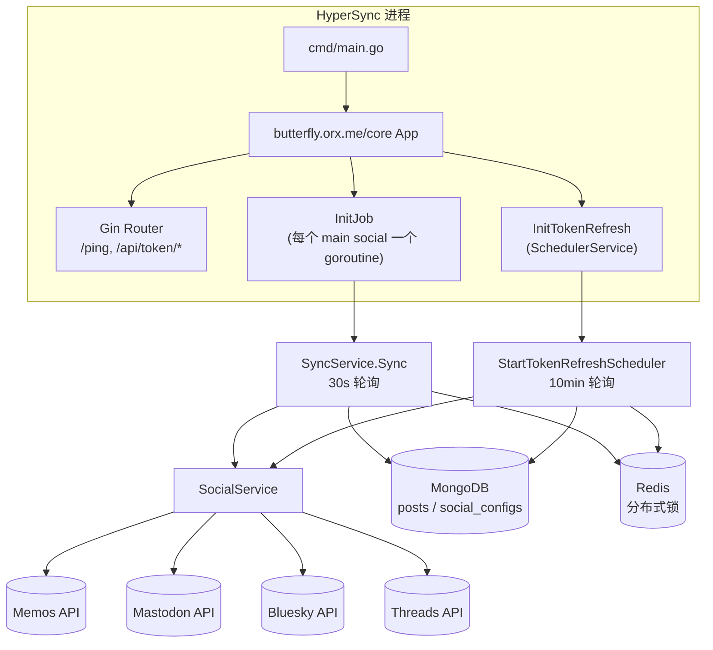
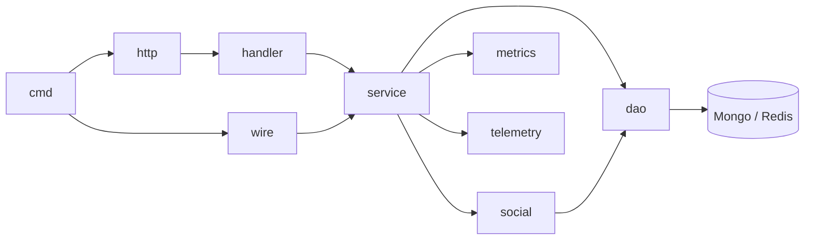

# 整体架构

## 一句话

HyperSync 是一个长驻 Go 服务，基于 `butterfly.orx.me/core` 框架启动。进程启动后会为每个配置了 `sync_to` 的源平台拉起一个独立的同步 goroutine，并附带一个 token 定时刷新 goroutine；同时暴露 Gin HTTP 接口用于 token 管理与健康检查。

## 运行时拓扑

## 分层

| 层 | 包 | 职责 |
| --- | --- | --- |
| 入口 | `cmd` | 进程启动、注册 InitFunc、把 Gin Router 交给 core |
| 框架接入 | `internal/app`, `internal/http` | App 占位与 Gin 路由注册 |
| 接口 | `internal/handler`, `pkg/proto/api/v1` | HTTP handler 与 Proto 生成代码（gRPC / Twirp / Connect） |
| 编排 | `internal/service` | SyncService、SocialService、SchedulerService、PostService、ContentConverter |
| 领域 | `internal/social` | 平台抽象（`SocialClient`/`Post`/`Media`/`VisibilityLevel`）与各平台实现 |
| 数据 | `internal/dao` | MongoDB 与 Redis 客户端、Post/SocialConfig 仓储、`ThreadsConfigAdapter` |
| 装配 | `internal/wire` | Google Wire DI |
| 可观测性 | `internal/metrics`, `internal/telemetry` | Prometheus 指标、OpenTelemetry trace |

## 启动顺序

`cmd/main.go:18` `NewApp` 把以下信息交给 core：

1. `Config` 指针 = `conf.Conf`（由 core 反序列化 YAML 填充）
2. `Service: "hypersync"`
3. `Router` = `http.Router`
4. `InitFunc`：
   - `InitIndexes`：确保 MongoDB `posts` 集合的 `(social, social_id)` 唯一索引存在（失败仅记录日志，不阻止启动）。
   - `InitJob`：遍历 `conf.Conf.Socials`，对所有 `len(SyncTo) > 0` 的平台调用 `wire.NewSyncService(main, syncTo)` 并启动定时同步 goroutine（默认 30s 间隔，可通过 `sync.interval` 配置）。
   - `InitTokenRefresh`：构造一个 `SchedulerService`，启动 `StartTokenRefreshScheduler`（10 分钟一次）。

`butterfly.orx.me/core` 负责初始化日志、配置加载、Mongo/Redis 客户端、HTTP server、Prometheus 暴露、OTel 接入等基础设施，HyperSync 自身只关心业务逻辑。

## 并发模型

- 每个主源一个长驻 goroutine。`Sync` 内部用 `redislock` 抢锁（key 为 `sync_service:<mainSocial>`），未抢到则跳过本轮——支持多副本横向部署。锁持有期间有续期 watchdog 防止长时间同步导致锁过期。
- `SchedulerService` 内部同样用 redislock 在 `RefreshAllTokens` 上做互斥（`scheduler_service.go:58`）。
- 单次 `doSync` 内部对每条 post 串行处理；目标平台投递在同一 goroutine 内顺序执行，便于精确记录每个目标的状态。

## 可观测性

- **Metrics**：`internal/metrics/sync_metrics.go` 定义 9 个 `hyper_sync_*` Prometheus 指标（含 `hyper_sync_retries_total`，已定义但尚未在同步逻辑中递增），标签包含 `main_social` / `target_platform` / `status` / `operation`。
- **Tracing**：`internal/telemetry/tracing.go` 定义 `SyncTracer`，在 sync_operation / fetch_posts / process_post / cross_post / database_* 五级 span 上注入语义化属性。
- **Logs**：使用 `butterfly.orx.me/core/log` 的 slog 兼容 logger，全程结构化键值对。
