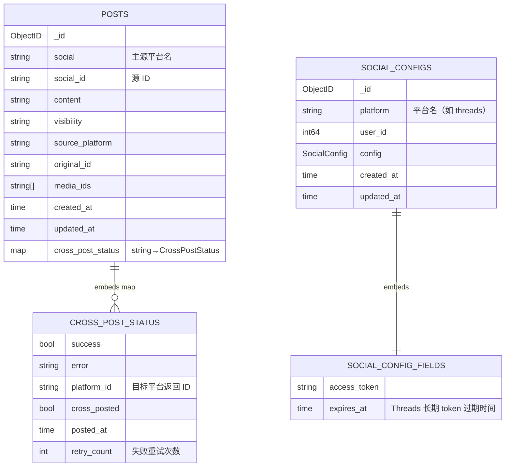

# 数据模型

MongoDB 数据库名硬编码为 `hypersync`（见 `internal/dao/mongo.go:21`）。Redis 仅用于分布式锁，不持久化业务数据。

## 集合一览



## `posts` 集合

Go 模型：`dao.PostModel`（`internal/dao/post.go:49`）。

去重键：`(social, social_id)`，通过 `GetBySocialAndSocialID` 查询。启动时 `InitIndexes` 会确保该唯一索引存在（`EnsureIndexes`）。

每条 post 同时记录：
- `source_platform` / `original_id`：源平台的视角（与 `social` / `social_id` 等价，因为 Sync 仅以 main social 作为 source）。
- `cross_post_status[target]`：每个目标平台的最终状态。键集合等于配置中 `sync_to` 的元素。

`PostDao` 接口对外暴露的方法：

```go
GetPostByID(ctx, id) (*PostModel, error)
GetPostByOriginalID(ctx, platform, originalID) (*PostModel, error)
GetBySocialAndSocialID(ctx, social, socialID) (*PostModel, error)
ListPosts(ctx, filter, limit, skip) ([]*PostModel, error)
CreatePost(ctx, *PostModel) (string, error)
UpdatePost(ctx, *PostModel) error
DeletePost(ctx, id) error
UpdateCrossPostStatus(ctx, postID, platform, status) error
```

## `social_configs` 集合

Go 模型：`dao.SocialConfigModel`（`internal/dao/social_config.go:17`）。

目前只用来存放 Threads 的长期 access token 与过期时间。读写通过 `social.TokenManager` 接口，实现是 `dao.ThreadsConfigAdapter`。

主键：`platform`（按平台 upsert）。

注：`SocialConfig.GetThreadsConfig` 在 `social_config.go:44` 引用了 `config.ClientID` 字段，但 `SocialConfig` 结构体本身没有这个字段——这是历史遗留，目前不会触发（`GetThreadsConfig` 没有被生产路径调用）。

## `sync_records` 集合

Go 模型：`dao.SyncRecordModel`（`internal/dao/sync_record.go:18`）。

**当前未被启用的同步路径**所使用。`SyncService` 选用 `posts` + `cross_post_status` 的方案，因此该集合在生产中通常为空。`PostService.SyncPost` / `StartSyncJob` 是另一套实现，使用此集合但目前未由 `cmd/main.go` 调用。

如果将来要清理：可以删除 `sync_record.go` 与 `MongoDAO` 上对应的方法，或保留作为备用。

## Redis

- 用途：分布式锁。
- 客户端来源：`butterfly.orx.me/core/store/redis` 的 `"locker"` 配置项。
- 锁键：
  - `sync_service:<mainSocial>`：每个源平台独立锁，2 分钟 TTL，且有锁续期 watchdog（每 TTL/2 刷新）。
  - `token_refresh`：每个刷新周期 5 分钟 TTL（`scheduler_service.go`）。
