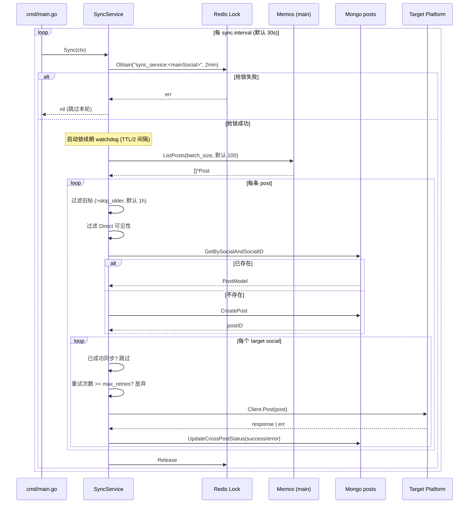
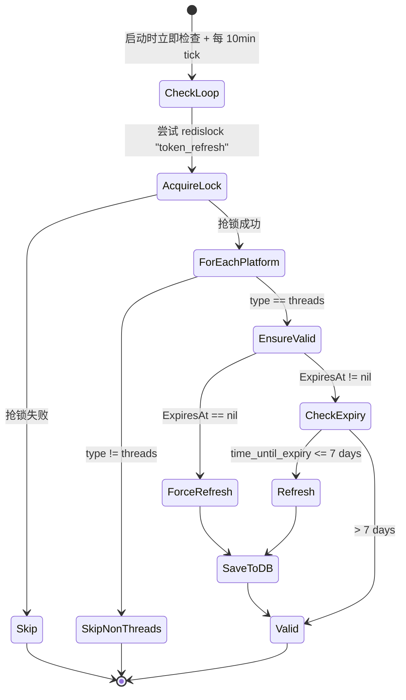
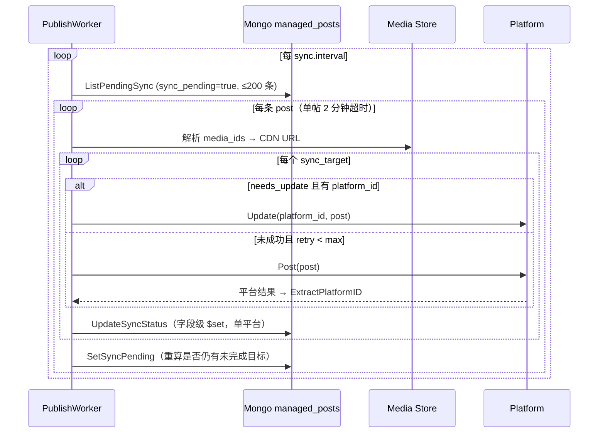

# 同步流程

`SyncService.Sync` 是 HyperSync 的核心循环，默认每 30 秒触发一次（可通过 `sync.interval` 配置）。本文档描述一次 `doSync` 调用内部的全部步骤。

源代码：`internal/service/sync_service.go`。

## 触发与调度



## 关键过滤规则

| 规则 | 位置 | 行为 |
| --- | --- | --- |
| 轮询间隔 | `cmd/main.go` | 默认 30s，可通过 `sync.interval` 配置 |
| 分布式锁 key | `sync_service.go` | `sync_service:<mainSocial>`，每个源平台独立锁 |
| 分布式锁 TTL | `sync_service.go` | `2 * time.Minute`，且有 **锁续期 watchdog**（每 TTL/2 刷新一次）防止长时间同步导致锁过期 |
| 拉取上限 | `sync_service.go` | 默认 100，可通过 `sync.batch_size` 配置 |
| 旧帖丢弃 | `sync_service.go` | `post.CreatedAt < now - skip_older`（默认 1h）→ `StatusSkippedOld` |
| Direct 私信丢弃 | `sync_service.go` | `Visibility == VisibilityLevelDirect` → `StatusSkippedDirect` |
| 已同步跳过 | `sync_service.go` | `CrossPostStatus[target].Success && CrossPosted == true` → 跳过该目标 |
| 重试上限 | `sync_service.go` | 失败的目标在下一轮 Sync 中会被重试，重试次数达到 `max_retries`（默认 3）后放弃 |

## 状态字段

每条 `PostModel` 的 `CrossPostStatus` 是一个 `map[string]CrossPostStatus`，key 为目标平台名：

```go
type CrossPostStatus struct {
    Success     bool
    Error       string
    PlatformID  string
    CrossPosted bool
    PostedAt    *time.Time
    RetryCount  int        // 失败重试次数，用于限制无限重试
}
```

状态语义：

| Success | CrossPosted | 含义 |
| --- | --- | --- |
| true | true | 已成功投递，下一轮跳过 |
| false | false（含 `PostedAt`） | 投递报错，下一轮重试（直到 `RetryCount >= max_retries`） |
| false | false（无 `PostedAt`） | 平台初始化失败（GetPlatform 报错），下一轮重试 |

## 内容映射

`SyncService` 当前直接把 `mainSocial.Client.ListPosts` 返回的 `*social.Post` 透传给 `targetPlatform.Client.Post`，**不做任何内容转换**。各平台客户端负责把统一的 `Post`/`Media`/`VisibilityLevel` 翻译成自己的 API 格式（例如 Memos 的 `PUBLIC/PROTECTED/PRIVATE` ↔ 通用 `public/unlisted/private`）。

`internal/service/content_converter.go` 中的 `ContentConverter` 提供更细的转换（markdown 清理、附件过滤等），但当前未被 `SyncService` 引用，属于备用实现。

## Span 与指标

每个层级的 span 都由 `SyncTracer` 创建（参见 `internal/telemetry/tracing.go`）：

```
sync_operation
├── fetch_posts                       (limit=100)
└── process_post                      (post_id, content_preview)
    ├── database_get_post
    ├── database_create_post          (仅新帖)
    └── cross_post                    (target_platform)
        └── database_update_status
```

并行触发的 Prometheus 计数器（参见 `internal/metrics/sync_metrics.go`）：

- `hyper_sync_posts_processed_total{status=processed|skipped_old|skipped_direct|exists}`
- `hyper_sync_cross_posts_total{target_platform,status=success|error}`
- `hyper_sync_operation_duration_seconds{operation=fetch_posts|sync_to_platform|total}`
- `hyper_sync_database_ops_total{operation,status}`
- `hyper_sync_errors_total{target_platform,error_type=platform_error|database_error|network_error}`
- `hyper_sync_posts_in_queue` / `hyper_sync_active_operations` (gauge)
- `hyper_sync_retries_total{target_platform}` (已定义，尚未在同步逻辑中递增)

## Token 刷新流程

`SchedulerService` 是独立于 `SyncService` 的后台任务，仅作用于 Threads 平台。



刷新窗口（`threads.go:159`）：长期 token 过期前 7 天开始尝试刷新。刷新失败但 token 仍未过期时返回 `nil`（容忍）；只有已过期且刷新失败时才报错。

## 发布流程（PublishWorker，Post 管理）

与上述**拉取式**的 `SyncService` 相对，`PublishWorker`（`internal/service/publish_worker.go`）是**推送式**的:把 HyperSync 原生创作的 Post 发布到目标平台。同样每 `sync.interval`（默认 30s）触发一次,复用 `sync.max_retries`（默认 3）。



要点：

- **工作队列**：只扫 `sync_pending=true` 的已发布 Post；服务层在创建/发布/编辑时置位,worker 处理完重算。全部成功（或重试耗尽）后标记清除,不再进入扫描。
- **并发安全**：worker 对单平台状态用字段级 `$set`（`UpdateSyncStatus`）,不整文档回写,因此不会覆盖用户在同步期间的编辑。
- **重试与恢复**：初次同步与 needs_update 更新路径都受 `max_retries` 约束;编辑 Post 会把各平台 `retry_count` 归零,是重试耗尽后的恢复手段。
- **平台 ID**：`social.ExtractPlatformID` 统一各平台 `Post()` 返回值（Mastodon `*Status`、Bluesky `rkey`、Threads `PublishResponse`、Memos map）,供后续 Update/Delete 使用。
- **可见性**：仅 `public` / `unlisted` 会同步;其他可见性的 Post 会被直接清除 pending 标记。
