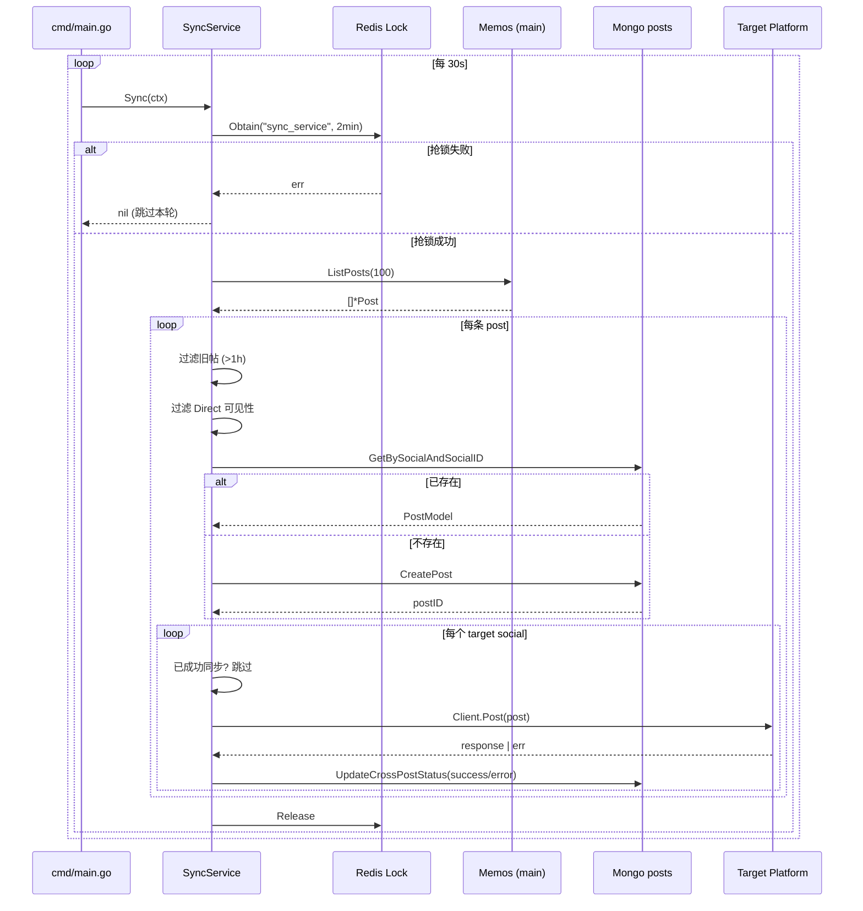
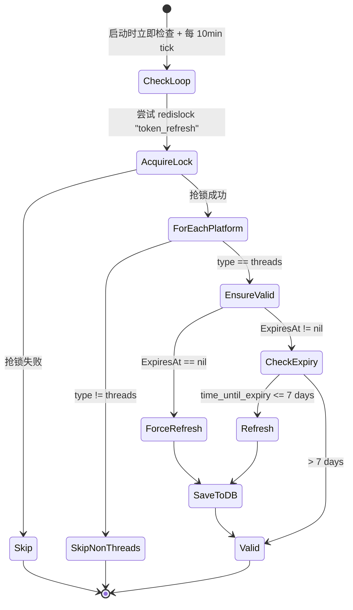

# 同步流程

`SyncService.Sync` 是 HyperSync 的核心循环，每 30 秒触发一次。本文档描述一次 `doSync` 调用内部的全部步骤。

源代码：`internal/service/sync_service.go`。

## 触发与调度



## 关键过滤规则

| 规则 | 位置 | 行为 |
| --- | --- | --- |
| 30s 间隔 | `cmd/main.go:88` | `time.Sleep(30 * time.Second)` 硬编码 |
| 分布式锁 TTL | `sync_service.go:44` | `2 * time.Minute`，单次 sync 超时会自动释放 |
| 旧帖丢弃 | `sync_service.go:123` | `post.CreatedAt < now - 1h` → `StatusSkippedOld` |
| Direct 私信丢弃 | `sync_service.go:135` | `Visibility == VisibilityLevelDirect` → `StatusSkippedDirect` |
| 已同步跳过 | `sync_service.go:218` | `CrossPostStatus[target].Success && CrossPosted == true` → 跳过该目标 |

注意：失败的目标在下一轮 Sync 中会被重试，没有 retry 次数上限。

## 状态字段

每条 `PostModel` 的 `CrossPostStatus` 是一个 `map[string]CrossPostStatus`，key 为目标平台名：

```go
type CrossPostStatus struct {
    Success     bool
    Error       string
    PlatformID  string
    CrossPosted bool
    PostedAt    *time.Time
}
```

状态语义：

| Success | CrossPosted | 含义 |
| --- | --- | --- |
| true | true | 已成功投递，下一轮跳过 |
| false | false（含 `PostedAt`） | 投递报错，下一轮重试 |
| false | false（无 `PostedAt`） | 平台初始化失败（GetPlatform 报错），下一轮重试 |

## 内容映射

`SyncService` 当前直接把 `mainSocial.Client.ListPosts` 返回的 `*social.Post` 透传给 `targetPlatform.Client.Post`，**不做任何内容转换**。各平台客户端负责把统一的 `Post`/`Media`/`VisibilityLevel` 翻译成自己的 API 格式（例如 Memos 的 `PUBLIC/PROTECTED/PRIVATE` ↔ 通用 `public/unlisted/private`）。

`internal/service/content_converter.go` 中的 `ContentConverter` 提供更细的转换（markdown 清理、附件过滤等），但当前未被 `SyncService` 引用，属于备用实现。

## Span 与指标

每个层级的 span 都由 `SyncTracer` 创建（参见 `internal/telemetry/tracing.go`）：

```
sync_operation
├── fetch_posts                       (limit=100)
└── process_post                      (post_id, content_preview)
    ├── database_get_post
    ├── database_create_post          (仅新帖)
    └── cross_post                    (target_platform)
        └── database_update_status
```

并行触发的 Prometheus 计数器（参见 `internal/metrics/sync_metrics.go`）：

- `hyper_sync_posts_processed_total{status=processed|skipped_old|skipped_direct|exists}`
- `hyper_sync_cross_posts_total{target_platform,status=success|error}`
- `hyper_sync_operation_duration_seconds{operation=fetch_posts|sync_to_platform|total}`
- `hyper_sync_database_ops_total{operation,status}`
- `hyper_sync_errors_total{target_platform,error_type=platform_error|database_error|network_error}`
- `hyper_sync_posts_in_queue` / `hyper_sync_active_operations` (gauge)

## Token 刷新流程

`SchedulerService` 是独立于 `SyncService` 的后台任务，仅作用于 Threads 平台。



刷新窗口（`threads.go:142`）：长期 token 过期前 7 天开始尝试刷新。刷新失败但 token 仍未过期时返回 `nil`（容忍）；只有已过期且刷新失败时才报错。
